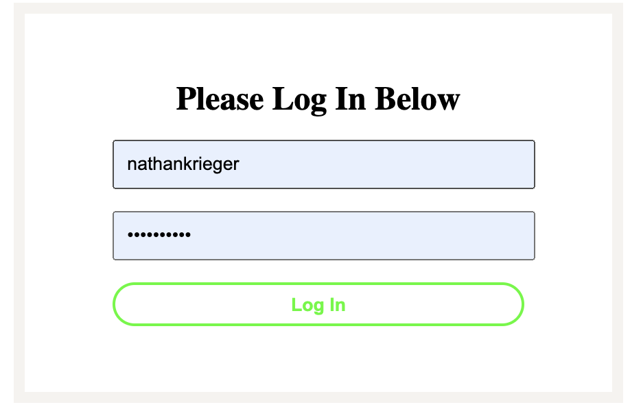
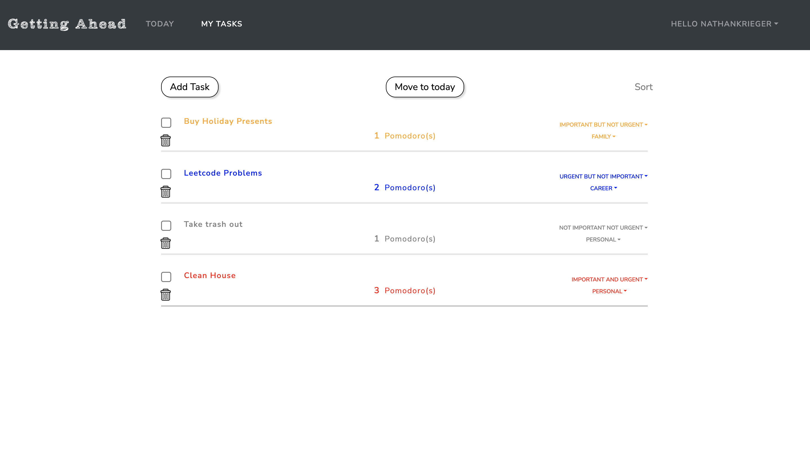
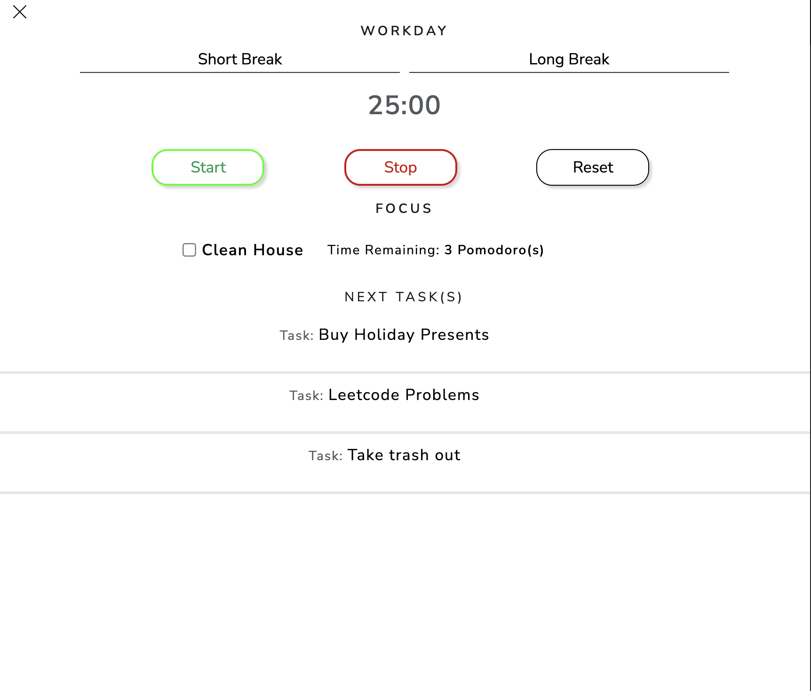

# Getting_Ahead
* Custom made productivity web app that adapts Stephen Covey's task methodology.
* Created using React, React-Router, Django Rest Framework, PostgreSQL, Babel, Webpack, React-Bootstrap
* Available for viewing at https://getting-ahead.herokuapp.com/

# Features 

## 1. User Authentication

## 2. Task Prioritization and organization of tasks by life area

## 3. Workday Dashboard with integrated pomodoro clock

